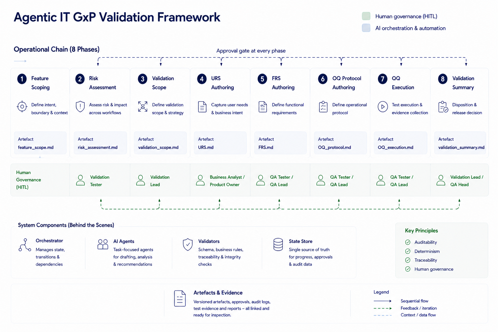

# Agentic IT GxP Validation Framework

An agentic framework for IT GxP validation work (computerised systems validation under GxP). A single Orchestrator skill coordinates eight specialist agents: each one phase of a V-model methodology — under Human-in-the-Loop gates and a Python schema-validation layer.

The framework is a reference implementation. It is not enterprise-deployable; the relationship to production GxP requirements is set out in [§2 of the design doc](./00_Project_Context/Agentic_Framework_Design.md).

---

## Scope

In scope:
- An eight-phase validation chain orchestrated as Claude Code skills, with a human approval gate after each phase
- AI Assistance Records — per-artifact YAML frontmatter plus an append-only `ai_assistance_log.jsonl`
- Per-phase Python schema validators
- An audit-log query CLI
- A worked end-to-end run on a non-pharma web application (Logout, in `02_Logout/`)

Out of scope:
- A production-ready GxP validation system
- A replacement for Veeva Vault, ValGenesis, Kneat, or any controlled document system
- Standalone compliance with 21 CFR Part 11, EU Annex 11, or GAMP 5 tool qualification

Production GxP deployment would require formal tool qualification (GAMP 5 Category 5), enterprise controlled-document hosting, and integration with regulated audit trail systems — none of which are in scope here.

---

## Architecture at a glance

The Orchestrator walks an eight-phase V-model under a Human-in-the-Loop (HITL) gate at every phase, with a Python schema validator at each handoff and an append-only audit log capturing every AI invocation and human approval.



Feature Scoping, Risk Assessment, and Validation Scope are pre-V bounding activities; the chain then descends the specification arm (URS → FRS), crosses to the OQ phases (OQ Protocol → OQ Execution), and climbs back to the Validation Summary Report. A higher-order Release Summary skill consolidates per-feature summaries for change-request / release rollups.

Agents are bounded by role and by directional isolation (ADR-001) — each specialist reads upstream artifacts only and writes its own artifact only. The Validation Summary Report skill is a declared exception.

For architecture, V-model traversal details, ADRs, and deferred design decisions, see [`00_Project_Context/Agentic_Framework_Design.md`](./00_Project_Context/Agentic_Framework_Design.md). For a short operational summary, see [`Architecture_Notes.md`](./Architecture_Notes.md).

---

## Repository structure

```
AI-native-GxP-Validation-Testing/
├── 00_Project_Context/
│   ├── Agentic_Framework_Design.md     # Design doc (v1.2)
│   ├── Application_Context.md
│   ├── Methodology.md                  # v1 methodology — deprecated
│   └── Templates/
├── 00_Validation_Management/
├── 01_Login/                           # v1 artifacts (pre-agentic, retained for reference)
├── 02_Logout/                          # First end-to-end agentic run; v1 artifacts in _archive/
├── Skills/                             # v1 prompt guides — deprecated, retained for reference
├── .claude/skills/                     # Agentic v2 skills (orchestrator + specialists)
│   ├── validate-feature.md             # Orchestrator (entry point)
│   ├── validation-feature-scoping.md
│   ├── validation-risk-assessment.md
│   ├── validation-scope.md
│   ├── validation-urs-author.md
│   ├── validation-frs-author.md
│   ├── validation-oq-protocol-author.md
│   ├── validation-oq-execution.md
│   ├── validation-summary-report.md
│   └── validation-release-summary.md   # Higher-order, for change-request / release rollup
├── validators/                         # Python schema validators (one per phase)
│   ├── _common.py
│   ├── _smoke_test.py                  # 18-case unit test suite
│   ├── feature_scoping.py
│   ├── risk_assessment.py
│   ├── validation_scope.py
│   ├── urs.py
│   ├── frs.py
│   ├── oq_protocol.py
│   ├── oq_execution.py
│   ├── summary_report.py
│   └── release_summary.py
├── tools/
│   └── audit.py                        # CLI to query ai_assistance_log.jsonl
├── ai_assistance_log.jsonl             # Append-only AI assistance record
└── README.md                           # This file
```

---

## Running a feature through the framework

Prerequisites:
- Claude Code installed (the orchestrator and specialists are Claude Code skills in `.claude/skills/`)
- Python 3.10+ (for the schema validators and the audit-log CLI)
- Playwright MCP configured (only for OQ Execution against a live system)

From Claude Code in the repo root, invoke the orchestrator in natural language. For example:

> Validate the Logout feature.

Or to resume an interrupted run:

> Resume the validation chain for Logout.

Claude Code discovers the `validate-feature` skill and walks the chain. At each phase:

1. The specialist agent produces its artifact (e.g. `Feature_Scoping_<feature>.md`).
2. The Python schema validator for that phase runs. If it fails, the agent is asked to correct and re-emit.
3. The artifact is surfaced to the reviewer for `approve` / `reject <reason>` / `changes <description>`.
4. An entry is appended to `ai_assistance_log.jsonl`.
5. On approve, the chain advances to the next phase.

Per-phase skills, allowed upstream reads, and the `state.json` schema are documented in [`.claude/skills/validate-feature.md`](./.claude/skills/validate-feature.md).

---

## AI Assistance Record

Every artifact carries YAML frontmatter declaring the agent skill, model, invocation timestamp, prompt version, and human review fields. The same information is written as a JSON line to the central `ai_assistance_log.jsonl` at each handoff.

Query the log:

```bash
python tools/audit.py --feature <FeatureName>
python tools/audit.py --model claude-opus-4-7 --since 2026-05-01
python tools/audit.py --reviewer shyaamlal --status approved
python tools/audit.py --artifact 01_Login/URS_Login.md
python tools/audit.py --tail 10 --format json
```

The CLI reads only the on-disk JSONL — no service, no database. Each entry includes the artifact's SHA-256, so post-hoc modification of an artifact is detectable against its logged hash.

---

## Methodology

Eight-phase, V-model:

1. **Feature Scoping** — observable behaviour, user-visible boundaries, system responses
2. **Risk Assessment** — GxP impact, patient safety, data integrity (organisation's chosen framework: GAMP 5 RBA, FMEA, HACCP, or equivalent)
3. **Validation Scope** — what will and will not be validated, justified against the risk assessment
4. **URS** — user requirements in user-facing language
5. **FRS** — functional requirements with explicit acceptance criteria per item
6. **OQ Protocol** — executable test cases tracing to FRS acceptance criteria
7. **OQ Execution** — executed test record
8. **Validation Summary Report** — consolidated package, the unit of audit for a single change

Plus an optional higher-order **Release Summary** that consolidates multiple per-feature Validation Summary Reports for change-request / release rollups.

Design Specification (DS) is deliberately deferred (see [§11.1](./00_Project_Context/Agentic_Framework_Design.md)) — in computerised systems validation, configurable systems typically substitute Configuration Specifications, and the chain URS → FRS (with acceptance criteria) → OQ Protocol traces cleanly without it.

This is prospective validation methodology (ADR-004), applied to features as they are introduced.

---

## Worked examples — Login (v1) and Logout (v2)

`01_Login/` holds artifacts produced under the v1 methodology (retrospective, ten-step, manual prompts in Claude Web). They are retained as a reference for the v1 → v2 transition. See [Appendix A of the design doc](./00_Project_Context/Agentic_Framework_Design.md) for the methodology comparison.

`02_Logout/` holds artifacts produced by the agentic framework end-to-end on 2026-05-18. The validated feature was the **Logout function of a multi-role web platform**, classified under GAMP 5 Category 5 as an **access control** with direct 21 CFR Part 11 and EU Annex 11 obligations (full rationale in [`02_Logout/Risk_Assessment_Logout.md`](./02_Logout/Risk_Assessment_Logout.md)). The run completed all eight phases — chain_status: complete, validation_status: Conditional Pass, zero feature defects. The 16-line `ai_assistance_log.jsonl` traces the full chain; `02_Logout/state.json` records the per-phase approvals. The original v1 Logout artifacts have been moved to `02_Logout/_archive/`.

The run also surfaced a set of framework-level findings — see [`Architecture_Notes.md` §4](./Architecture_Notes.md#4-findings-from-the-worked-logout-run) for the three foregrounded observations (human ownership of substance; pre-execution review; hallucinations propagating through human review) and the additional findings documented alongside them.

---

## Methodology metrics

The framework already captures the data needed for methodology-performance analysis through the existing audit log. This tool reads that data and surfaces it as metrics — closing the measurement loop without adding new instrumentation.

`tools/methodology_metrics.py` reads `ai_assistance_log.jsonl` and computes methodology-level metrics for a run — wall-clock and per-phase timing, HITL decision distribution, validator pass/fail counts, in-gate amendments (an artifact changed at the human gate and re-validated, tracked via `prior_surfaced_hash`), bottlenecks, and an audit-log integrity scan. It derives everything from the existing log; it does not add instrumentation or estimate missing values.

```bash
python tools/methodology_metrics.py --feature Logout
python tools/methodology_metrics.py             # defaults to most recent complete run
python tools/methodology_metrics.py --json      # machine-readable output
```

Sample output against the Logout run:

| Phase | Name | Duration | Schema | HITL | In-gate amendments |
|---|---|---|---|---|---|
| 1 | feature-scoping | 1m 45s | pass:2 | approved:1 | 0 |
| 2 | risk-assessment | 6h 48m 28s | pass:2 | approved:1 | 0 |
| 3 | validation-scope | 4m 31s | pass:2 | approved:1 | 0 |
| 4 | urs | -22s | pass:2 | approved:1 | 0 |
| 5 | frs | 2m 13s | pass:2 | approved:1 | 0 |
| 6 | oq-protocol | 8m 25s | pass:2 | approved:1 | 1 |
| 7 | oq-execution | 14m 41s | pass:2 | approved:1 | 0 |
| 8 | summary-report | 1m 37s | pass:2 | approved:1 | 0 |

The metrics surfaced framework-level findings from the Logout run — including an audit-log integrity anomaly and two instrumentation gaps. These are documented in [`Architecture_Notes.md §4`](./Architecture_Notes.md#4-findings-from-the-worked-logout-run).

---

## Smoke-testing the validators

```bash
python validators/_smoke_test.py
```

Generates synthetic valid and invalid artifacts for every phase, runs each through its validator, and reports expected-vs-actual. 18 cases. This is a unit test of the validator layer — not an end-to-end framework test. The end-to-end run is in `02_Logout/`.

---

## Enterprise toolchain context

In a real deployment, requirements would flow from JIRA / Azure DevOps; OQ protocols and execution records would land in HP ALM / X-Ray / TestRail; the AI assistance log would feed enterprise audit trails. This framework does not implement those integrations.

---

## Reference

- [Design document v1.2](./00_Project_Context/Agentic_Framework_Design.md) — architecture, ADRs, deferred decisions
- [Orchestrator skill](./.claude/skills/validate-feature.md) — invocation, per-phase protocol, state.json schema
- [Specialist skills](./.claude/skills/) — one per phase
- [Validators](./validators/) — per-phase schema validators + shared helpers + smoke test
- [Audit CLI](./tools/audit.py) — queries over the AI assistance log

---

## License

Shared for educational and professional reference purposes. The validation artifacts and code in this repository are for demonstration only and would require formal tool qualification before any production use under GxP.

---

## Contact

**LinkedIn:** [shyaamlal-n-n](https://www.linkedin.com/in/shyaamlal-n-n/)
